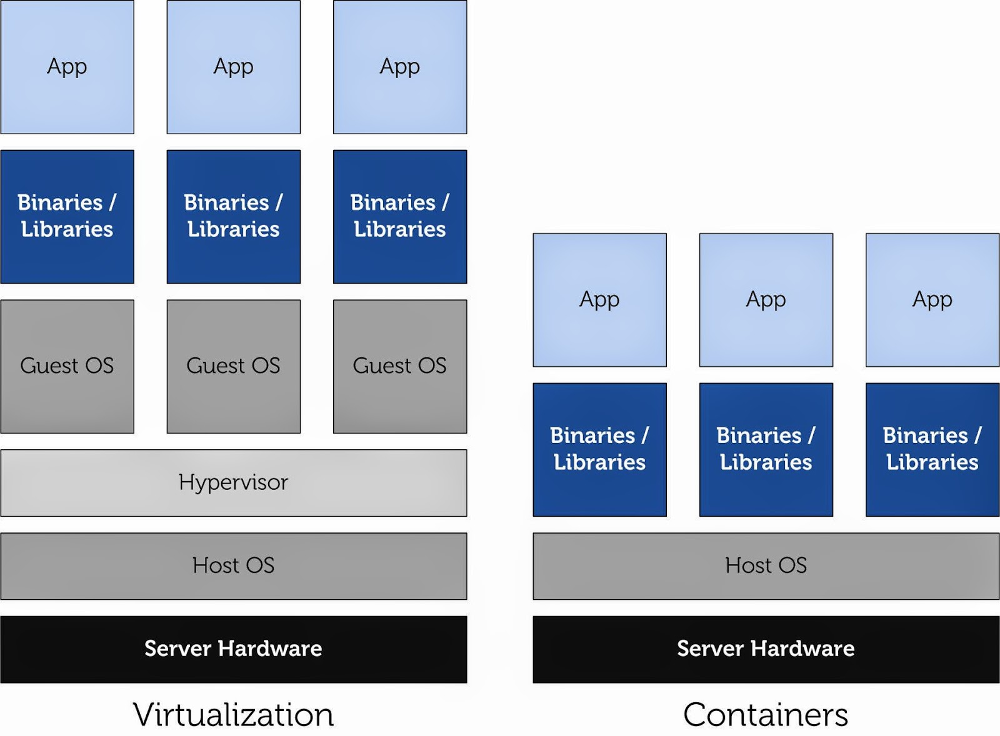

# docker簡介
## 什麼是docker
docker是一個開源項目，用go語言編寫，主要目標是實現輕量級的操作系統虛擬化，基礎是由Linux容器技術(LXC)，利用linux和心中的資源分離機制(cgroups)，以及linux核心命名空間(namespaces)，來建立獨立的容器(containers)，可在單一linux實體下運作

- linux核心命名空間:完全隔離工作環境中應用程式的視野，包括行程樹、網路、使用者ID與掛載檔案系統
- linux核心cgroups:提供資源隔離，包括CPU、記憶體、block I/O與網路

docker容器與虛擬機的差別在於，容器是將作業系統層虛擬化，而虛擬機則是虛擬化硬體，因此具有可攜式性，高利用性，並且無視基礎設施的差異，可部署到任何環境

## 優點
- 更快速的交付和部署
- 更高效的虛擬化
- 更輕鬆的遷移和擴展
- 更簡單的管理

### docker vs 傳統vm
| 特性       | 容器 | 傳統vm |
| ---------- | ---- | ------ |
| 啟動速度   | 秒級 | 分鐘級 |
| 硬碟使用   |  一般為MB    |    一般為GB    |
| 性能       |    接近原生  |    較弱    |
| 系統支持量 |    單機支持上千個容器  |    一般為幾十個    |

## docker QA
docker想解決的問題：

改善傳統虛擬機器因為需要額外安裝作業系統（Guest OS），導致啟動慢、佔較大記憶體的問題

docker要提供的解法：

以應用程式為核心虛擬化，取代傳統需要Guest OS的虛擬化技術

## 參考資料
- [Docker 基礎教學與介紹 101. 何謂容器虛擬化、介紹 Docker 三元素、手把手建立 Docker… | by Cheng-Wei Hu | 胡程維 | Medium](https://cwhu.medium.com/docker-tutorial-101-c3808b899ac6)