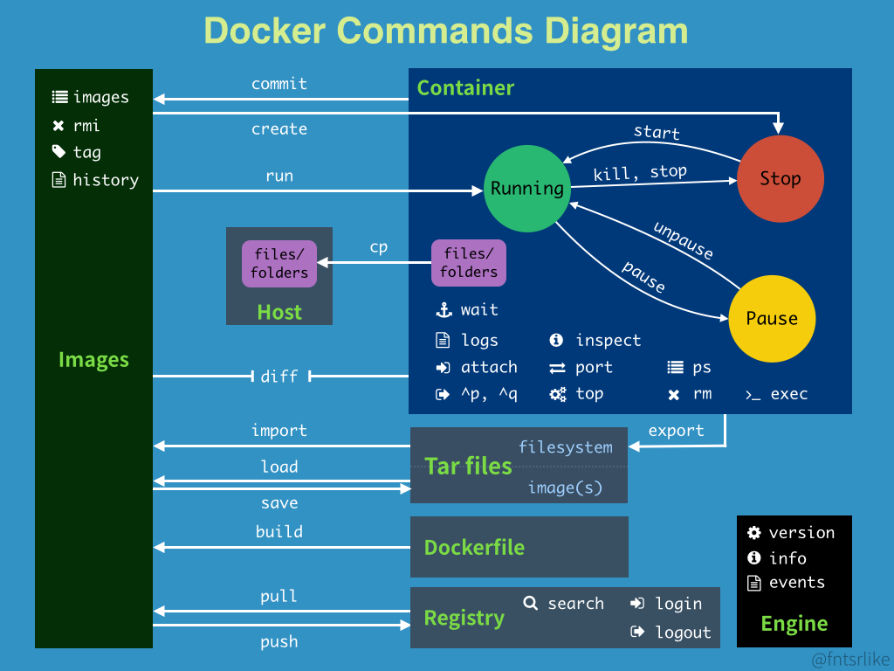

```shell
attach    # 當前shell下attach連接指定運行鏡像
build     # 通過dockerfile定製鏡像
commit    # 提交當前容器為新的鏡像
cp        # 從容器中拷貝指定文件或者目錄到本機
create    # 創建一個新的容器,同run,但不啟動容器
diff      # 查看docker容器變化
events    # 從docker服務獲取容器實時事件
exec      # 在已存在的容器上運行命令
export    # 導出容器的內容流作為一個tar
history   # 顯示鏡像形成歷史
images    # 列出系統當前鏡像
import    # 從tar包中的內創建一個新的文件系統映像
info      # 顯示系統相關信息
inspect   # 查看容器詳細信息
kill      # kill指定docker容器
load      # 從一個tar包中加載一個鏡像
login     # 註冊或登入docker源服務器
logout    # 從當前docker repo退出
logs      # 輸出當前容器日誌信息
port      # 查看映射端口對應的容器內部源端口
pause     # 暫停容器
ps        # 列出容器列表
pull      # 從docker鏡像源服務器拉取指定鏡像
push      # 推送指定鏡像至docker源服務器
restart   # 重啟運行的容器
rm        # 移除一個或多個容器
rmi       # 移除一個或多個鏡像
run       # 創建一個新的容器並運行一個命令
save      # 保存一個鏡像為一個tar 包
start     # 啟動容器
stop      # 停止容器
tag       # 給源中鏡像打標籤
top       # 查看容器中運行的進程信息
unpause   # 取消暫停的容器
version   # 查看docker版本號
wait      # 擷取容器停止時的退出狀態值

```

