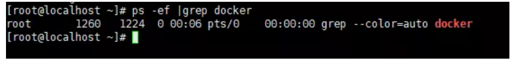

# Installation

## 環境
* CentOS 7
* docker 17.12.1
* docker-compose 1.7.1

## docker安裝步驟

1. 檢查系統中是否已經安裝了docker
```shell
ps -ef |grep docker
```

如上圖所示，說明系統中並沒有安裝docker

2. 添加docker-ce repo
   1. 安裝yum倉庫管理工具
    ```shell
    sudo yum install -y yum-utils
    ```
   2. 配置docker yum源
    ```shell
    sudo yum-config-manager --add-repo https://download.docker.com/linux/centos/docker-ce.repo
    ```
3. 查看docker-ce各版本
```shell
yum list docker-ce --showduplicates|sort –r
```

4. 安裝指定的docker-ce版本
```shell
sudo yum install docker-ce-17.12.1.ce -y
```
5. 啟動docker
```shell
sudo systemctl start docker

# 查看docker狀態
systemctl status docker

# 查看docker各項參數
docker info
```
6. 設置開機啟動docker
```shell
sudo systemctl enable docker.service
sudo systemctl start docker.service
```

## docker-compose 安裝步驟
1. 下載docker-compose
```shell
sudo curl -L "https://github.com/docker/compose/releases/download/1.7.1/docker-compose-$(uname -s)-$(uname -m)" -o /usr/local/bin/docker-compose
```
2. 修改權限
```shell
sudo chmod +x /usr/local/bin/docker-compose
```
3. 建立軟連結
```shell
sudo ln -s /usr/local/bin/docker-compose /usr/bin/docker-compose
```

4. 確認版本
```shell
docker-compose --version
```


## 參考資料
* [Install Docker Compose](https://docs.docker.com/compose/install/)
* [Install Docker Engine on CentOS](https://docs.docker.com/engine/install/centos/)
* [CentOS Linux 7 安裝 Docker 步驟與使用教學](https://blog.gtwang.org/linux/centos-linux-7-install-docker-tutorial/)